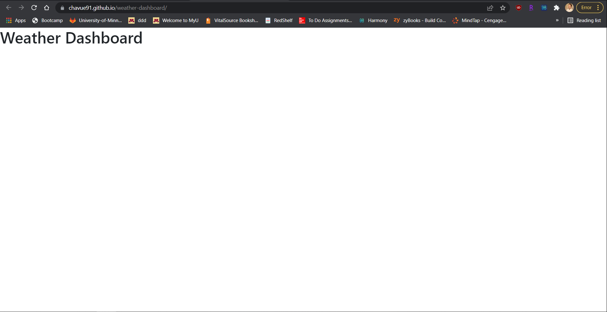

# Weather Dashboard

This is a weather application that will retrieve weather information from a third party API to display a five day forecast of a location that the user enters. This data will be retained in the local storage.

## Website deployment 
[https://chavue91.github.io/weather-dashboard/] (https://chavue91.github.io/weather-dashboard/)

## Repo 
(https://github.com/chavue91/weather-dashboard)

## images
